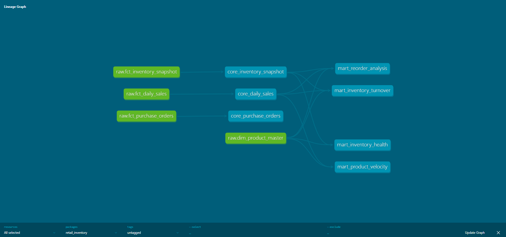
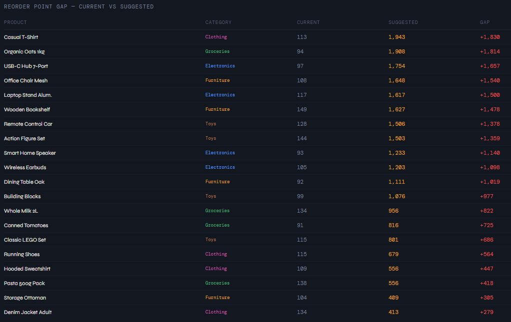
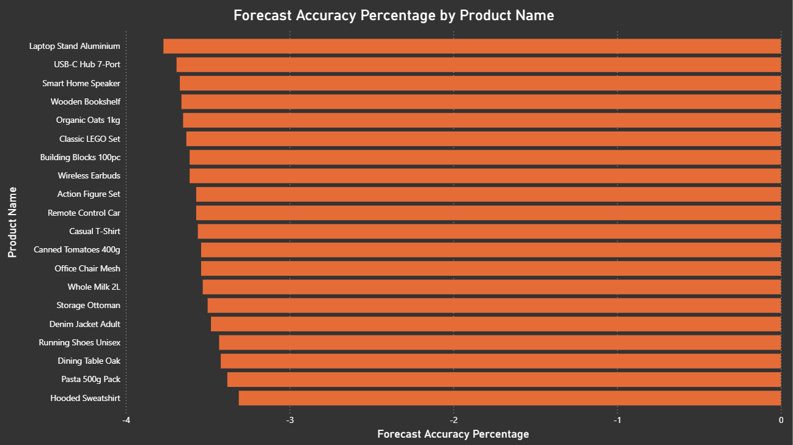
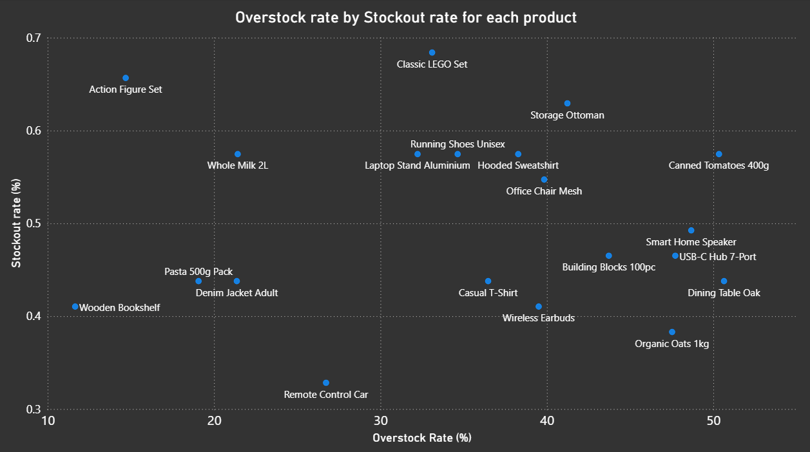
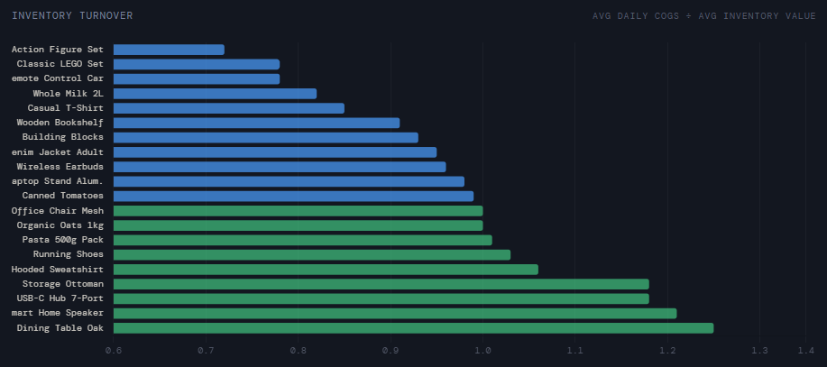

# Retail Inventory Intelligence
## An end-to-end analytics pipeline built on S3, Snowflake, dbt Core, and Power BI to identify stockout risk, overstock patterns, and reorder optimisation opportunities across a 20-product retail catalogue.

## Introduction

Retailers face two costly inventory problems simultaneously, stock that sits unsold tying up cash, and stock that runs out before replenishment arrives losing sales. This project builds a full analytical pipeline to identify which products are affected, quantify the impact, and surface data-driven reorder recommendations. All of this is created in an end-to-end workflow, data is ingested via S3, and stored in Snowflake. The data is transformed in dbt, documentation recorded, and testing procedures put in place to export to Power BI where stockout rates, overstock patterns, inventory turnover, and reorder gaps are visualised in a single operational dashboard. Important to know - this data is taken from https://www.kaggle.com/datasets/anirudhchauhan/retail-store-inventory-forecasting-dataset
which is composed of synthetic data for a fictitious company. However this data is realistic for analysing and forecasting retail store inventory demand. It contains over 73,000 rows of data across five(5) stores and twenty(20) products.

## Going Beyond the Dataset

This dataset was published as a machine learning challenge, designed for demand forecasting models, LSTM networks, and dynamic pricing experiments typically explored in Jupyter notebooks.

Rather than following that path, I took the same data and built something closer to a production analytics environment. A fully layered data warehouse with RAW, CORE, and MART separation, 39 automated data quality tests, documented models, the kind of infrastructure a real retail analytics team would operate on.

The analysis focused not on prediction but on diagnosis, identifying where the inventory system is failing today, why it is failing, and what specific changes would fix it. The findings around reorder point misconfiguration, systematic forecast bias, and replenishment timing are immediately actionable without a single machine learning model.

The natural next phase would extend this pipeline with a Python-based demand forecasting layer, replacing the existing forecast column with a model built on actual historical sales patterns, and feeding improved predictions back into the reorder analysis. That work is in progress.

## AI-Assisted Development

This project was built in collaboration with Claude (Anthropic) as an AI analytical thinking partner.

Claude was used throughout this project for:

- **Code review** - SQL models were written independently and reviewed for logic errors, analytical correctness, and best practices
- **Analytical reasoning** - business logic behind each MART model was reasoned through conversationally before any code was written, ensuring models answered real operational questions
- **Documentation** - README structure and writing were developed collaboratively, with all content reflecting genuine project decisions

Claude did not write this project. I asked questions, it flagged errors, explained concepts, and challenged assumptions - functioning as a senior colleague available throughout the build.

This reflects how AI tools are used in modern data teams, not as code generators, but as thinking partners that accelerate learning and improve output quality. The ability to work effectively with AI assistants is increasingly a core professional skill, and this project was built with that in mind.

## Problem Statement

Let me explain where retailers get caught, too little stock (stockout), and too much stock (overstock):

Too little stock:

1) Lost sales when the customer wants the item, but the shelf is empty, so the customer shops elsewhere.
2) When repeat customers who cant get a repeat order, chooses another company to get their goods.
3) When you need to recover the gap in stock, so you pay a higher cost for faster shipping or inflated costs at short notice.

Too much stock:

1) Cash tied up in products that are not moving off the shelf.
2) Markdowns and/or discounts needed to clear away this stock.
3) If goods are perishable or seasonal, they may need to be thrown away completely, wasting money.
4) Storage costs accumulate on slow-moving items

These two errors often have the same root cause, reorder points and demand forecasts that dont reflect actual sales patterns. You order too late and run out, or you over-correct and order too much.

## Architecture

Data flows through three layers:

- **RAW** - source tables loaded directly from S3 into Snowflake via COPY INTO. No transformations applied.
- **CORE** - one view per source table. Casts data types, adds boolean flags, and derives basic fields. Built as views so they always reflect current RAW data.
- **MART** - aggregated tables built on CORE models. Each mart answers a specific business question and is materialised as a table for query performance.

## Tech Stack

| Tool | Purpose |
|------|---------|
| Amazon S3 | Cloud storage - raw CSV file landing zone |
| Snowflake | Cloud data warehouse - RAW, CORE, and MART layers |
| dbt Core | Transformation, testing, and documentation |
| Power BI | Dashboard and visualisation layer |
| Git & GitHub | Version control |

## Data Model

### RAW Layer : Source Tables

| Table | Description |
|-------|-------------|
| `dim_product_master` | Dimension table containing all unique products, their categories, suppliers, unit cost, base price, reorder points, reorder quantities, and supplier lead times. |
| `fct_daily_sales` | Daily sales transactions across all stores. Contains transaction ID, date, store, units sold, unit price, discounts applied, weather conditions, seasonality, competitor pricing, gross revenue, and net revenue. |
| `fct_inventory_snapshot` | Daily stock level snapshot per product per store. Contains opening and closing stock, units ordered, demand forecast, days of supply, and inventory value. |
| `fct_purchase_orders` | Supplier-facing purchase order records. Contains order and expected receipt dates, quantities ordered, unit cost, total order value, supplier ID, and order status (PENDING or RECEIVED). |

### CORE Layer : Cleaned Source Tables (Views)

| Model | Description |
|-------|-------------|
| `core_inventory_snapshot` | Cleans and types the raw inventory snapshot. Casts date strings to DATE, integer flags to BOOLEAN, and currency columns to DECIMAL(10,2). Serves as the foundation for inventory health and reorder analysis. |
| `core_daily_sales` | Cleans and types the raw sales data. Casts date strings to DATE, holiday promo flag to BOOLEAN, and price/revenue columns to DECIMAL(10,2). Primary source for velocity and turnover analysis. |
| `core_purchase_orders` | Cleans and types the raw purchase order data. Adds a derived `planned_lead_time` column calculated from order and expected receipt dates. Not consumed by any MART model in this project, retained as a foundation for future supplier performance analysis. |

### MART Layer : BI-Ready Aggregated Tables

| Model | Description |
|-------|-------------|
| `mart_product_velocity` | Classifies products as High or Low Velocity based on average daily units sold relative to the overall product average. Identifies fast and slow movers across the catalogue. |
| `mart_inventory_health` | Calculates stockout and overstock rates per product per store as a percentage of total trading days. Surfaces which product-store combinations have the most critical inventory imbalances. |
| `mart_inventory_turnover` | Measures how efficiently stock is converted to sales by comparing average daily COGS against average daily inventory value. A ratio below 1.0 indicates stock is not moving fast enough relative to holding costs. |
| `mart_reorder_analysis` | Compares current reorder points against data-driven suggestions based on actual average daily demand multiplied by supplier lead time. Also validates demand forecast accuracy against actual sales. |

## Key Findings

### Finding 1 : Reorder Points Are Critically Underset

Every product in the catalogue has a current reorder point set far below what actual sales data suggests it should be. The worst case is Casual T-Shirt, currently configured to trigger a reorder at 113 units but based on average daily sales multiplied by supplier lead time, the correct trigger point is 1,943 units. This gap of 1,830 units means that by the time a reorder is placed, there is not enough stock remaining to last through the supplier's delivery window. Stockouts are structurally inevitable under the current configuration. This is not a product-specific issue, every single product shows a positive reorder gap, indicating a systemic misconfiguration across the entire inventory system.

---

### Finding 2 : Demand Forecasts Systematically Overestimate Sales

Across all 20 products, the demand forecast consistently overestimates actual sales by approximately 3.5%. While a 3.5% deviation may appear minor, the consistency across every product suggests the forecasting inputs or assumptions are uniformly optimistic. In practice this leads to ordering slightly more stock than demand requires, which compounds the overstock problem identified elsewhere in this analysis. A well-calibrated forecast should show deviations distributed around zero, some products over, some under. A one-directional bias across the entire catalogue signals the forecast model needs recalibration and points to the issue of this dataset being synthetic in nature.

---

### Finding 3 : ProductsAreSimultaneouslyOverstoandExSOk vs Sutcts Are Simultaneously Overstocked and Experiencing Stockouts

The most counterintuitive finding in this analysis is that products can be overstocked and stockout at the same time. Canned Tomatoes, for example, is overstocked on 50% of trading days yet still experiences stockouts. Stock arrives in large batches creating a temporary overstock, sells down over time, runs out before the next order arrives, and then the cycle repeats. The root cause is not the reorder quantity but the reorder timing. Products sitting in the high overstock and high stockout quadrant of the scatter plot are the highest priority for replenishment cycle redesign, adjusting order frequency rather than order size.

---

### Finding 4 : Inventory Turnover Is Below Benchmark Across the Catalogue

Inventory turnover measures how efficiently stock is being converted into sales. A healthy retail operation typically targets a turnover ratio of 4–12x per year. In this dataset, turnover ratios range from 0.72 to 1.25, well below any retail benchmark. This means stock is sitting in the warehouse longer than it should be relative to the value being sold. Action Figure Set and Classic LEGO Set have the lowest turnover at 0.72 and 0.78 respectively, indicating these products tie up the most cash relative to their sales velocity. It is important to note that this finding is partially a consequence of synthetic data calibration — inventory values were generated at a lower scale than sales volumes. In real operational data, this metric would provide a more reliable signal of cash efficiency.

## Recommendations

Reorder points across all 20 products should be recalculated immediately using actual average daily sales multiplied by supplier lead time. The current configuration is underset across the entire catalogue, with Casual T-Shirt, Organic Oats, and USB-C Hub carrying the largest gaps. Until this is corrected, stockouts are structurally unavoidable regardless of how much stock is ordered.

The demand forecasting model requires recalibration. A consistent 3.5% overestimate across every product is not random error - it is a systematic bias that compounds overstock levels over time. Adjusting the model inputs to reduce this directional bias will improve order accuracy and free up cash currently tied up in excess stock.

For products simultaneously experiencing high overstock and stockout rates, particularly Canned Tomatoes, Smart Home Speaker, and Dining Table Oak, the solution is not to order more but to order more frequently in smaller batches. The replenishment cycle is the problem, not the volume. Smoother, more consistent deliveries will reduce the boom-and-bust pattern currently driving both metrics in the wrong direction.

Finally, the eight products with inventory turnover below 0.85 should be reviewed for promotional intervention. Action Figure Set and Classic LEGO Set are tying up the most cash relative to their sales velocity. Targeted discounting or bundling strategies would accelerate sell-through and improve overall capital efficiency across the catalogue.

